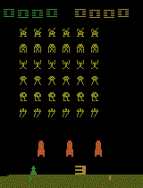

# A3C

This project is my attempt at implementing the [Asynchronous Methods for Deep Reinforcement Learning (A3C) Paper](https://arxiv.org/pdf/1602.01783.pdf).

Currently the [PyTorch version](torch_a3c.py) is functional, and a TensorFlow version is being worked on.

## Environment

The environment the model is trained on is [SpaceInvaders-v0](https://gym.openai.com/envs/SpaceInvaders-v0/) from OpenAI's [gym](https://gym.openai.com) library. In this environment, the input received is a 210x160 RGB screenshot and the output is an integer reward as shown on screen and a boolean for if the game is done. Here is an example of a full game cycle.

## Asynchronous Design

Python multiprocessing (which forks and executes) subprocesses were used rather than threading in this project due to the CPU bound nature of the functions, which renders multithreading almost as inefficient as single threading due to [Python GIL contention](https://realpython.com/python-gil/).

## Training

The original paper model parameters, preprocessing sequence and training parameters were replicated as best as it could be discerned and training is currently in progress. Currently, the best is:

